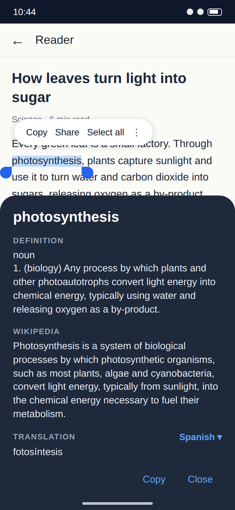
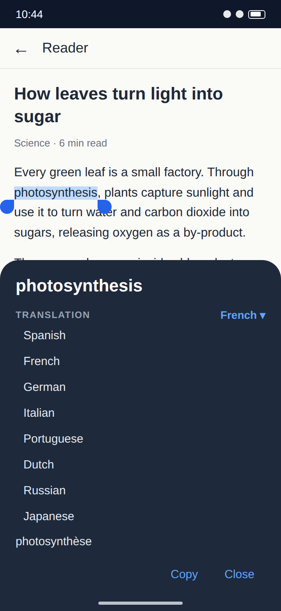
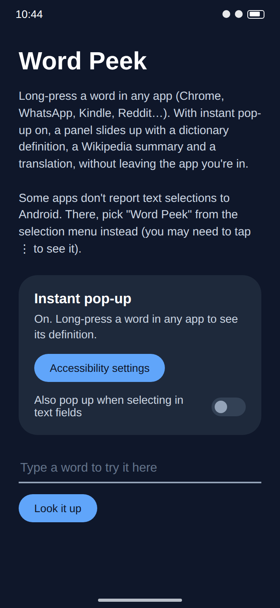

# Word Peek

Word Peek shows a word's definition, Wikipedia summary and translation as soon as you long-press it, in any Android app. A panel slides up from the bottom of the screen, and you never leave the app you're reading.

| Long-press a word | Pick a translation language | Home screen |
|:---:|:---:|:---:|
|  |  |  |

<sub>These images are renders of the app's layouts, not device screenshots.</sub>

## Features

- **Instant pop-up.** Select a word or short phrase in any app and the panel appears on its own, with no menu to open.
- **Definition** from Wiktionary, with dictionaryapi.dev as a fallback. For forms like "quantized" it also shows the base word ("quantize").
- **Wikipedia summary** in your phone's language, falling back to English.
- **Translation** into one of 13 languages. Word Peek remembers your choice.
- **Copy** the translation, or **Replace** the selected text with it when you're editing a text field.
- **Selection menu fallback.** "Word Peek" also appears in the text-selection menu, for apps that don't report selections to Android and for longer passages.
- **Small and dependency-free.** No account, no ads, no tracking. The APK is under 100 KB.

---

# For users

## Quick start

1. **Install.** Download the latest `WordPeek.apk` from this repository's Releases page on your phone and open it. Allow "Install unknown apps" for your browser or file manager when asked. Play Protect may warn about an unknown developer; tap "Install anyway".
2. **Open Word Peek** and tap **Turn on**. In Accessibility settings, choose **Word Peek instant pop-up** and switch it on.
3. **If the switch is greyed out** or says "Restricted setting": Android blocks this for apps installed from a file. Go back to Word Peek, tap **App info**, tap ⋮ at the top right, choose **Allow restricted settings**, and repeat step 2.
4. **Try it.** Long-press any word in Chrome, a news app or a chat. The panel slides up about half a second after the selection stops moving.

Works on any phone or tablet running Android 6.0 or later, up to Android 17. On Android 6.0–7.0, a lookup service whose HTTPS certificate comes from Let's Encrypt may fail to load, because those versions don't trust it.

## Using Word Peek

- **Close the panel** by tapping outside it, tapping Close, or clearing the selection. Drag the selection handles to look up a different word; the panel updates.
- **The instant pop-up handles up to 6 words (80 characters).** Longer selections are usually for copying, so they don't trigger it. For longer text, open the selection menu and pick **Word Peek**.
- **Text fields** you're typing in are skipped by default, so selecting text to edit doesn't keep opening the panel. Turn on **Also pop up when selecting in text fields** on the home screen to include them.
- **Change the translation language** by tapping the language name (for example "Spanish ▾") in the panel.
- **Replace** appears only when you opened Word Peek from the selection menu of an editable field. It swaps the selection for the translation.

## Privacy

To see what you select, Word Peek runs as an accessibility service, so Android warns that it can view your screen. Word Peek acts only on text you select. Password fields are always ignored. The selected text is sent to Wiktionary, dictionaryapi.dev, Wikipedia and MyMemory (translation) to look it up. Word Peek stores only your language and text-field settings on the phone.

## Troubleshooting

| Problem | What to do |
|---|---|
| The panel never appears | Open Word Peek and check the Instant pop-up card says "On". If not, repeat quick-start steps 2–3. |
| The panel appears in some apps but not others | Some apps draw their own text and don't report selections to Android. Use **Word Peek** in the selection menu (tap ⋮ if it isn't shown). |
| A section says "returned an error (HTTP …)" | That lookup service is having problems. Try again in a moment; the other sections still work. |
| A section says "Couldn't reach the server" | Check your connection. The text in brackets names the error, which helps if you report a bug. |

---

# For developers

## How it works

The app is written in Kotlin and uses only Android framework APIs: no AndroidX, Material or networking libraries.

| File | Role |
|---|---|
| `WordPeekAccessibilityService.kt` | Listens for `TYPE_VIEW_TEXT_SELECTION_CHANGED` in other apps and extracts the selected range from the event text (or the source node). It waits 450 ms for the selection to settle, then adds the panel as a `TYPE_ACCESSIBILITY_OVERLAY` window. The window is not focusable, and `FLAG_WATCH_OUTSIDE_TOUCH` lets an outside tap dismiss it while the touch still reaches the app underneath. It skips password fields, editable fields (unless enabled) and selections over 6 words. It hides the panel when the selection collapses or another app comes to the front. |
| `ProcessTextActivity.kt` | Handles `ACTION_PROCESS_TEXT` (the selection-menu entry) in a translucent activity. When the source field is editable, Replace returns the translation through `EXTRA_PROCESS_TEXT`. |
| `OverlaySheet.kt` | The panel both entry points share (`res/layout/overlay_sheet.xml`). It runs each lookup on a background thread. Generation counters drop results that arrive after the query or language has changed. |
| `Lookup.kt` | Blocking HTTP calls using `HttpURLConnection` and `org.json`: Wiktionary's REST definition endpoint (following "form of" links to the base word), dictionaryapi.dev as fallback, the Wikipedia page-summary API and MyMemory. HTTP 404 means "not found". Other statuses throw `HttpError`, which the panel shows with its host and code. |
| `MainActivity.kt` | Home screen. Shows whether the service is enabled (read from `Settings.Secure.ENABLED_ACCESSIBILITY_SERVICES`), links to accessibility settings and App info, and holds the text-field toggle and a test box. |
| `MaxHeightScrollView.kt` | Caps the panel's scroll area at 55% of the screen, so the buttons stay visible. |

The service configuration is in `res/xml/accessibility_service.xml`. Min SDK is 23 (Android 6.0), the first version with `ACTION_PROCESS_TEXT`. Newer APIs (`Html.fromHtml` with flags, `WindowInsets.Type`, `fitInsetsTypes`) are only called behind version checks. Android 8+ uses the adaptive icon in `mipmap-anydpi-v26`; older versions use the PNGs in `mipmap-*dpi`. Target SDK is 37 (Android 17), so edge-to-edge is enforced; both windows pad for system-bar insets themselves.

## Project layout

```
app/src/main/
  AndroidManifest.xml
  java/com/wordpeek/          Kotlin sources (see above)
  res/                        layouts, strings, styles, adaptive icon, accessibility config
docs/images/                  README renders, plus the HTML and script that produce them
```

## Building

### With Gradle

Requirements: JDK 17 or later, and the Android SDK with platform `android-37.0` (Gradle installs the build-tools it needs). Point Gradle at the SDK with `ANDROID_HOME` or a `local.properties` file containing `sdk.dir=/path/to/sdk`.

```bash
./gradlew assembleDebug      # → app/build/outputs/apk/debug/app-debug.apk
./gradlew assembleRelease    # → app/build/outputs/apk/release/, minified with R8
./gradlew lint
adb install app/build/outputs/apk/debug/app-debug.apk
```

The build uses Android Gradle Plugin 9.4 with its built-in Kotlin support (Kotlin 2.4) and Gradle 9.8 through the wrapper. The release APK is signed only when `WORDPEEK_KEYSTORE` is set (see below); otherwise it comes out as `app-release-unsigned.apk`. Builds need no GitHub service: everything runs on your own machine.

### Signing a release

Release builds are signed with a private key that is never committed. Create one once with the JDK's `keytool`:

```bash
keytool -genkeypair -v -keystore wordpeek-release.jks -alias wordpeek \
  -keyalg RSA -keysize 4096 -validity 10000
```

Keep it outside the repo. `.gitignore` excludes `*.jks`, `*.keystore` and `keystore.properties` in case one ends up in the tree. Then build with the key's location and passwords in the environment:

```bash
WORDPEEK_KEYSTORE=/path/to/wordpeek-release.jks \
WORDPEEK_KEYSTORE_PASSWORD=... \
WORDPEEK_KEY_ALIAS=wordpeek \
./gradlew assembleRelease
# → app/build/outputs/apk/release/app-release.apk
```

`WORDPEEK_KEY_PASSWORD` is only needed if the key's password differs from the keystore's. The APK carries a v1 (JAR) signature as well as v2, because Android 6 can't verify v2.

Android installs an update only if its signature matches the installed app. Back up the keystore and passwords somewhere other than this computer: if they're lost, users have to uninstall to get updates.

### Updating the README images

The images are rendered from `docs/images/screens.html`, which copies the colours, sizes and strings from the app's layouts. After changing the UI, update that file to match, then run:

```bash
PW=$(npm root -g)/playwright node docs/images/render.js
```

The PNG launcher icons for Android 6–7 are rendered from the adaptive icon's paths by `docs/images/render-icons.js` (same `PW=…` invocation). Re-run it if you change `ic_launcher_foreground.xml`.

## Licence

MIT. See [LICENSE](LICENSE).
